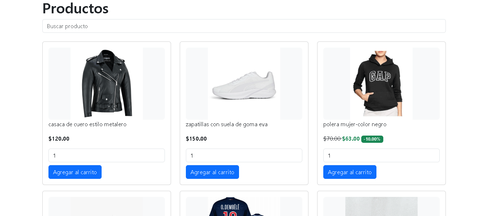
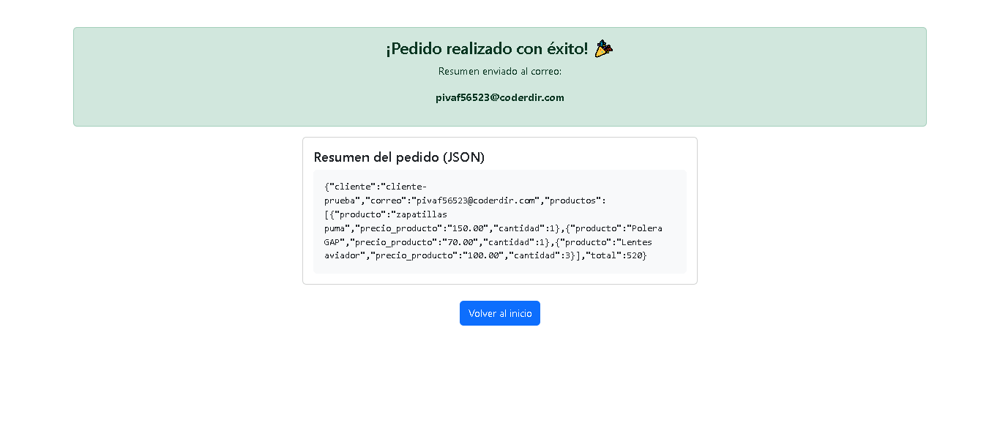
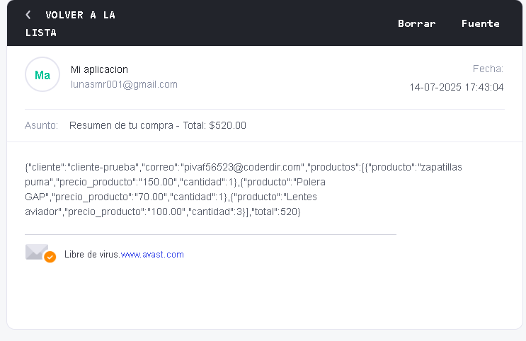
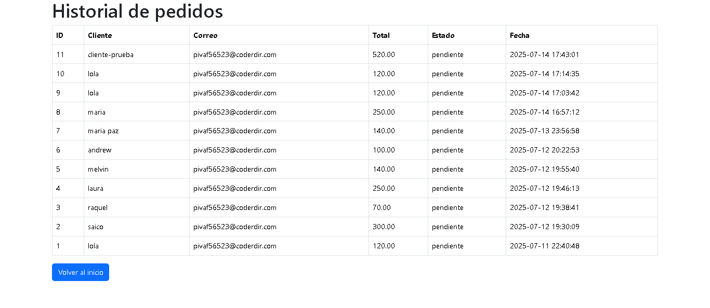

Ropa-Carrito es una tienda virtual sencilla donde los usuarios pueden:
- Registrarse e iniciar sesión
- Agregar productos al carrito
- Ver descuentos
- Finalizar la compra
- Recibir un resumen de su compra por correo electrónico

Tecnologías usadas
- PHP
- Bootstrap 5
- PHPMailer
- MySQL (XAMPP)

 Capturas

Formulario de inicio de sesion
.png)

Formulario de crear usuario

Dashboard

Lista de productos a escoger

Carrito de compras llenado
.png)

Pedido realizado

Mensaje en el correo registrado para la compra

Historial de pedido

Demo en video:
[Ver demostración en YouTube](https://youtu.be/A7sOaTKctjI)

